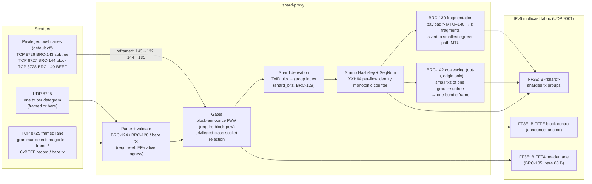
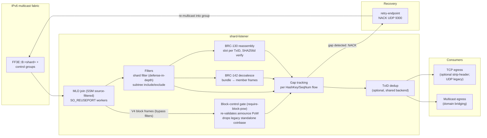
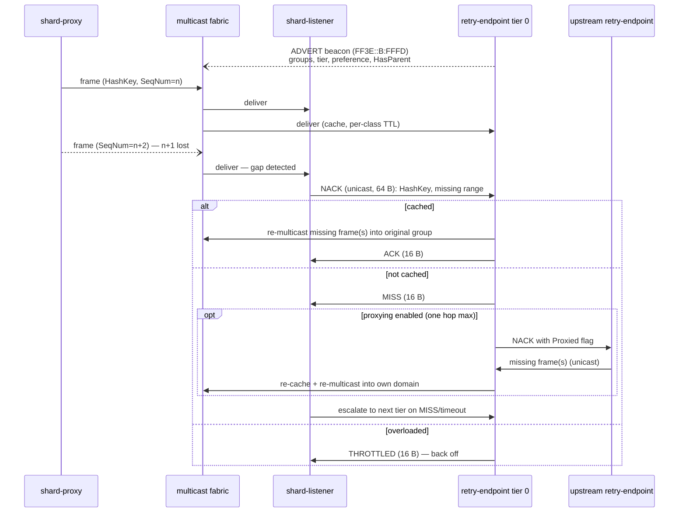

# Diagrams

Component and flow diagrams for the multicast pipeline, maintained as Mermaid
sources (rendered natively by GitHub). [DESIGN.md](../DESIGN.md) and the
[`docs/`](../docs/) BRC specifications are authoritative; these diagrams are
orientation aids.

Addressing is shown as SSM (`FF3E::B:<shard>`, the deployment default);
ASM (`FF05::`/`FF0E::`) remains supported — see DESIGN.md § Source-Specific
Multicast.

## shard-proxy (ingress)

Stateless ingress: parse, gate, shard, stamp, emit. One frame in, one (or k
fragments, or one bundle) out — no per-flow state beyond monotonic SeqNum
counters.

## shard-listener (egress)

Role modes: `-mode collapsed` (default, everything below), `receiver`
(multicast half only), `delivery` (consumer half only: unicast ingest +
fan-out, no join/gap/NACK).

## NACK retransmission (BRC-126)

Wire detail, tier escalation, and cross-domain proxying:
[BRC-126](../docs/brc-126-retransmission-protocol.md).

